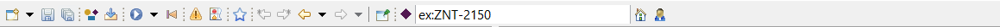
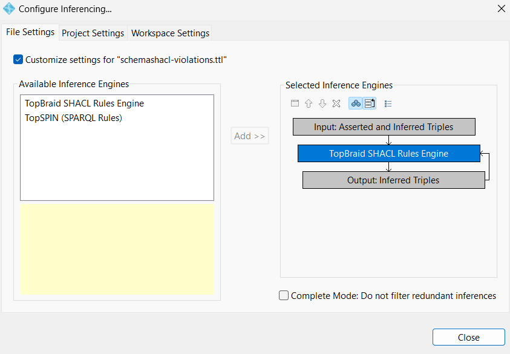
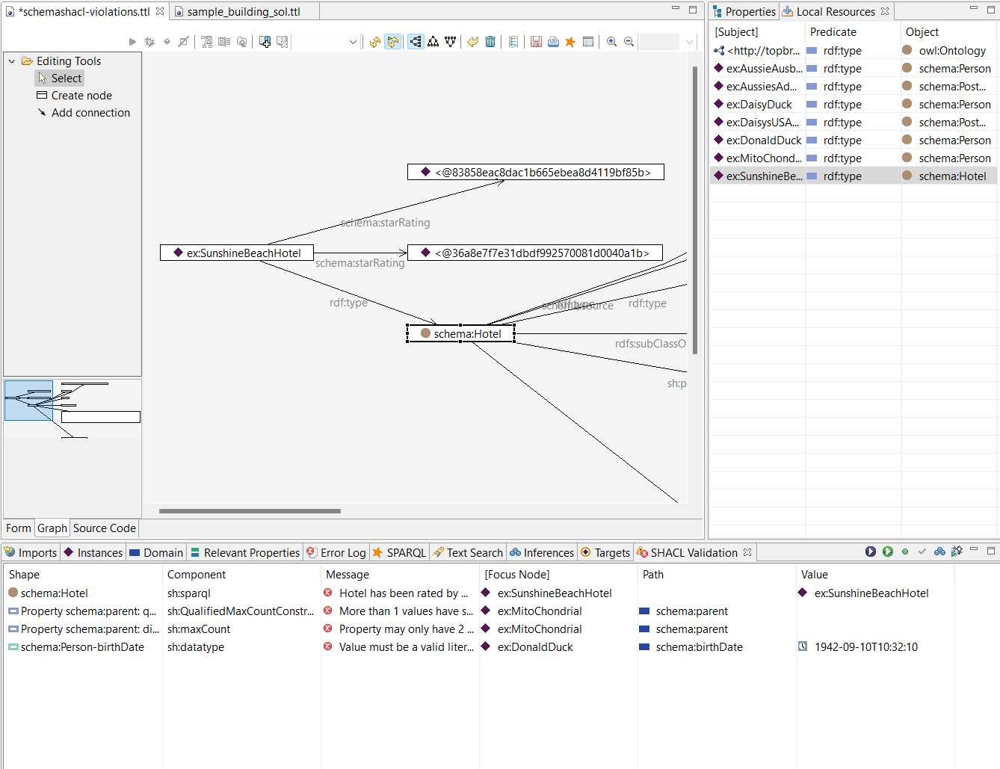

# Getting Started with TopBraid
This document provides guidence to get started with using TopBraid Composer. It is recommended that you first have an understanding of the material covered in the [Building System Semantic Modeling document](README.md).

## Installation 
After purchasing a licence to TopBraid Composer, you will get an email containing a [download link](https://archive.topquadrant.com/topbraid-composer-install/) and a serial number. The email will tell you to refer to the [FAQ Page](https://archive.topquadrant.com/knowledge-assets/faq/tbc/) for installation instructions. The most helpful FAQ tabs are "How can I get started with TopBraid Composer?" and "How do I register my product with a license key file?" 

## Navigating TopBraid
Once you have opened TopBraid and selected your workspace, you can begin to explore the platform. Find the *Project Explorer* tab to open a file. In the TopBraid folder, there is another folder titled "Examples". Choose one of these to begin. Here, we will discuss and show the file titled `schemashacl-violations.ttl`.
___

*Figure 1:* This is the TopBraid Composer Tool Bar that appears at the top of the page. Refer to this image in the next sections.

### Local Resources
First, locate and open the local resources tab. Under this tab, you will be able to view all of the RDF triples that are in the file that is currently open. At the top of the page, there is a bar with various tools (*Figure 1*). When hovering over the button that is fourth from the left (it has a small yellow circle, blue rectangle, and red square), it says *Find all locally defined resources*. By clicking, you will see all of the triples apear on the Local Resources tab. This will be used later in the Graph section of this document.
___
### Configure Inferencing
Look again to the tool bar in *Figure 1* and you will see a button that looks like a blue circle with a white triange inside. Hover over it and it will say *Run Inferences*. To configure inferencing, click on the drop down arrow next to that button. For our purpose, follow these steps to set up your configuration and your pop-up should look like *Figure 2*.
1. Check the box in the upper right side that says *Customize settings for schemashacl-violations.ttl*
2. Click on the box that says *TopSPIN (SPARQL Rules)* then click the white *X* above it to delete.
3. Click on the button that looks like three blue circles and says *Start with existing inferred triples*
4. Select the box that says *TopBraid SHACL Rules Engine*
5. Click the button that looks like three boxes with an arrow and says *Iterate until no further triples have been added*

6. Inferencing has been configured and you can choose the close button

*Figure 2:* This is what the Configure Inferencing pop-up should look like when you are finished.

Once you have configured inferencing for a file, like you now have for the `schemashacl-violations.ttl` file, you will not have to do so again. The same configuration will be saved from last time you used TopBraid.
___
### Running Inferences
Now, find and select the tab that is titled *Inferences*. This is where the inferred triples appear. Click the button on the tool bar that is sixth in the row (looks like a blue circle with a white triangle in it). This allows for the inferences to be made about your file based on the configuration that was previously set. Each time that you open TopBraid, you will have to run inferences again. When you select this button for the `schemashacl-violations.ttl` file, you will have been able to make 14 inferences.
___
### SPARQL
In the lower part of your TopBraid window, there are a variety of tabs, one of which is *SPARQL*. This is where you will be able to type and run SPARQL queries. Click the small green arrow on the upper right corner and you will see the subjects and objects that correspond to your query appear.
___
### SHACL
In the same row as the *SPARQL* tab, there is another titled *SHACL Validation*. Select this tab, and in its top right corner you will see some buttons. The first button is another blue circle with a white triangle inside. Clicking this allows you to preform constraint testing for all instances in the model except classes. The *SHACL Validation* tab is shown visually in *Figure 3*.
___
### Graph
When you have a file open, there are a few tabs at the bottom of the window. Select the tab that says *Graph*. This will make a single node appear on the screen. By hovering over that node, an orange arrow appears that says *Expand outgoing connections*. Select this and you will see more nodes and connections appear.

Refer back to the *Local Resources* tab. By double clicking on one of the triples in this tab, it will appear as a node on the graph window. You can now repeat the process of expanding and viewing the graph. In *Figure 3*, I selected the triple with subject *ex:SunshineBeachHotel* and expanded some outgoing conections as an example. You can see at the bottom left corner of *Figure 3* there is a reduced version of the graph with a transparent blue square hovering over it. Move that square around the graph to adjust where you are viewing. Also, refer to the tools at the top right corner of the graph window.

*Figure 3:* This is what the graph window looks like. You can also see the *Local Resources* tab where the triple was selected from as well as the *SHACL Validation* tab.

## Next Steps
From this point, continue to explore TopBraid. Hover over a button to see its function. You can import your own `.ttl` files into TopBraid to run queries on them, edit the graphs, and more. For instance, try importing one of the `.ttl` files that were created in a tutorial found in the [Brick Model document](First-BRICK-Model.md). Use the *Find all locally defined resources* button to view the triples that are in that file. Under the *Local Resources* tab, choose a triple and look at the graph. *Expand outgoing connections* to see more relationships that you previously stated when creating the Brick model. 